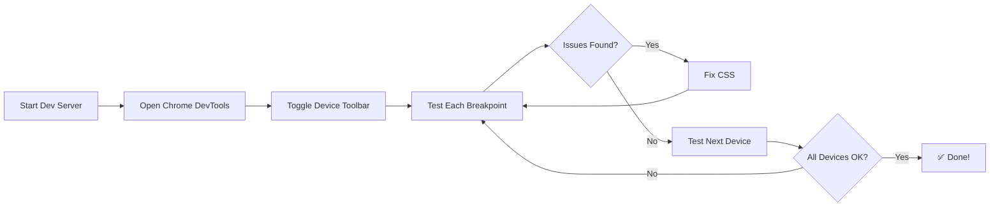

# 🧪 Responsive Testing Guide

## Cách Test Giao Diện Responsive

### 🔍 Chrome DevTools (Recommended)

1. **Mở DevTools**
   - Press `F12` hoặc `Ctrl+Shift+I` (Windows)
   - Press `Cmd+Option+I` (Mac)

2. **Toggle Device Toolbar**
   - Click icon 📱 (Toggle device toolbar)
   - Hoặc press `Ctrl+Shift+M` (Windows) / `Cmd+Shift+M` (Mac)

3. **Chọn Device Preset**
   ```
   iPhone SE        → 375 x 667px
   iPhone 12 Pro    → 390 x 844px  
   iPhone 14 Pro Max→ 430 x 932px
   iPad Mini        → 768 x 1024px
   iPad Pro         → 1024 x 1366px
   ```

4. **Custom Responsive Testing**
   - Click "Responsive" dropdown
   - Drag màn hình để test các breakpoints

### 📐 Test Breakpoints

Kiểm tra các breakpoints chính:

#### 📱 **Mobile (< 480px)**
- [ ] Header logo không bị crop
- [ ] Nav menu collapse thành hamburger icon
- [ ] Vehicle cards stack 1 column
- [ ] Buttons full width
- [ ] Text readable (không quá nhỏ)

#### 📱 **Large Phone (480px - 640px)**
- [ ] Timeslot grid: 2-3 columns
- [ ] Padding tăng lên
- [ ] Map height: 300px

#### 📱 **Tablet (640px - 768px)**  
- [ ] Vehicle grid: 2 columns
- [ ] Center selection: 2 columns
- [ ] Map height: 300px

#### 💻 **Desktop (768px - 992px)**
- [ ] Vehicle grid: 2-3 columns
- [ ] Time selection: 2 columns (calendar | timeslots)
- [ ] Map height: 400px

#### 🖥️ **Large Desktop (992px+)**
- [ ] Vehicle grid: 3+ columns
- [ ] Center selection: 1.2fr 1fr ratio
- [ ] Map height: 500px
- [ ] Full padding restored (2rem)

### ✅ Checklist Tổng Quát

#### 1. **No Horizontal Scroll**
```bash
# Mở console và chạy:
document.body.scrollWidth <= window.innerWidth
# → Should return: true
```

#### 2. **Images Don't Overflow**
- [ ] Vehicle images fit container
- [ ] Map image scales properly
- [ ] Logo không bị distorted

#### 3. **Text Readability**
- [ ] Font size >= 14px trên mobile
- [ ] Line height comfortable
- [ ] Contrast ratio đủ (WCAG AA: 4.5:1)

#### 4. **Touch Targets (Mobile)**
- [ ] Buttons >= 44px height
- [ ] Adequate spacing between clickable elements
- [ ] No accidental clicks

#### 5. **Spacing & Layout**
- [ ] Consistent padding/margin
- [ ] No overlapping elements
- [ ] Grids stack properly

### 🎨 Visual Testing

#### Before Fix:


#### After Fix:


### 🐛 Common Issues to Check

1. **Overflow X**
   ```css
   /* Should be set */
   overflow-x: hidden;
   max-width: 100vw;
   ```

2. **Box Sizing**
   ```css
   /* All elements should have */
   box-sizing: border-box;
   ```

3. **Grid Minmax**
   ```css
   /* Mobile: Should NOT be too large */
   ❌ minmax(320px, 1fr)  /* Too big for 375px screens */
   ✅ minmax(280px, 1fr)  /* Better */
   ```

### 📊 Performance Metrics

Check these on mobile:

- [ ] **Largest Contentful Paint (LCP)** < 2.5s
- [ ] **First Input Delay (FID)** < 100ms  
- [ ] **Cumulative Layout Shift (CLS)** < 0.1

### 🔧 Quick Fixes

If something looks wrong:

```css
/* Add these utilities */
.fix-overflow {
  max-width: 100%;
  overflow-x: hidden;
}

.responsive-img {
  max-width: 100%;
  height: auto;
}

.responsive-grid {
  grid-template-columns: repeat(auto-fit, minmax(min(100%, 280px), 1fr));
}
```

### 🌐 Browser Testing Matrix

| Browser | Desktop | Mobile |
|---------|---------|--------|
| Chrome  | ✅      | ✅     |
| Firefox | ✅      | ✅     |
| Safari  | ✅      | ✅     |
| Edge    | ✅      | ✅     |

### 📱 Real Device Testing (Optional)

Nếu có thiết bị thật:

1. **Get local IP:**
   ```bash
   npm run dev -- --host
   ```

2. **Access from phone:**
   ```
   http://<your-ip>:5173
   ```

3. **Use ngrok for remote testing:**
   ```bash
   npx ngrok http 5173
   ```

### 🎯 Testing Workflow



### 📝 Report Template

Nếu tìm thấy bug:

```markdown
## 🐛 Responsive Bug Report

**Device:** iPhone 12 Pro (390px)
**Breakpoint:** < 480px
**Issue:** Vehicle grid không stack thành 1 column
**Expected:** 1 column layout
**Actual:** 2 columns (overflow)
**Screenshot:** [attach]

**Fix:**
\`\`\`css
@media (max-width: 640px) {
  .vehicle-grid {
    grid-template-columns: 1fr;
  }
}
\`\`\`
```

---

**Happy Testing! 🚀**

*Updated: October 20, 2025*
